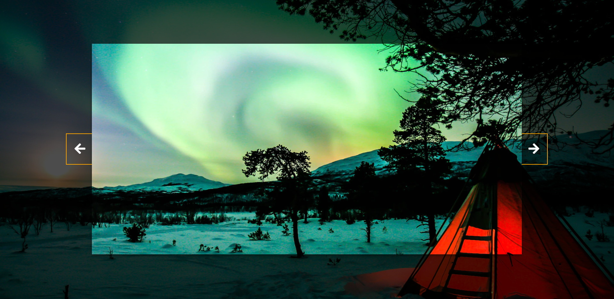

> Projeto Controle Deslizante de Fundo

 🔗 [Acesse aqui](https://prdsilva80.github.io/controle-deslizante-de-fundo/)

# 🛠️ Ferramentas Utilizadas

   

# 👨‍🎓 O que aprendi

- Aprimorando o entendimento do HTML
- Aprimorando o entendimento do CSS
- Melhorando o entendimento do JavaScript

# 📧 Contato

- probertos717@gmail.com
